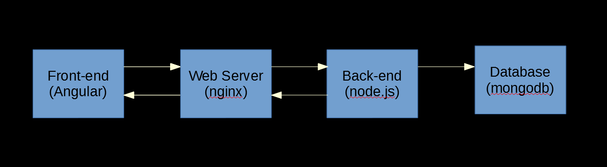
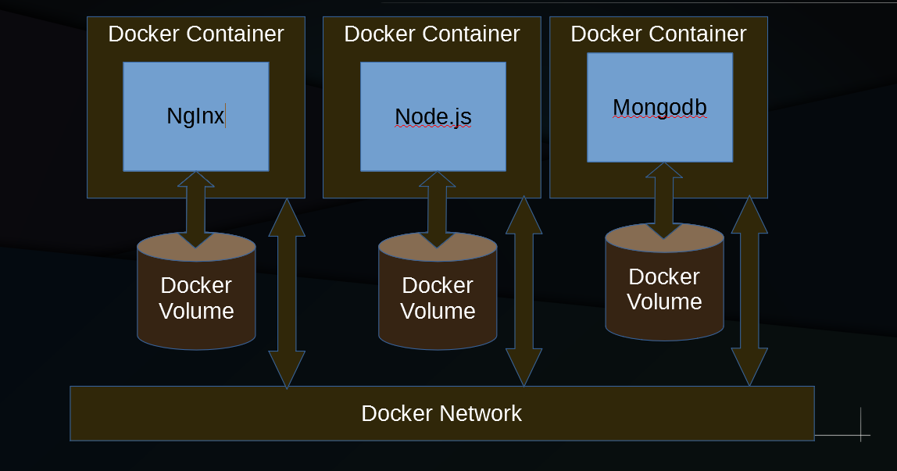
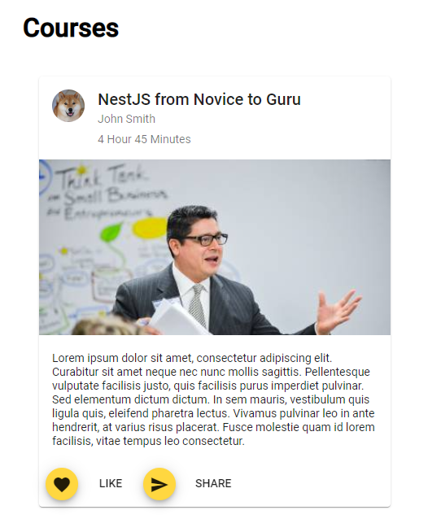
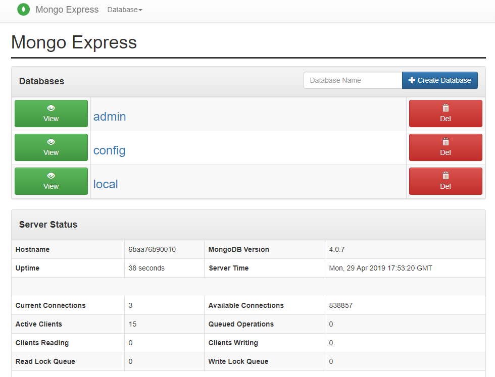
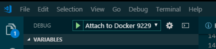
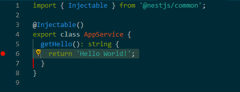
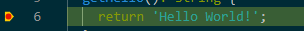
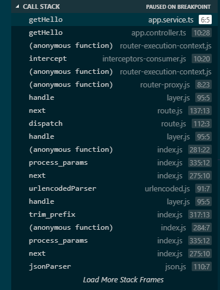

# ng-nest-poc

- Written by Anthony Leotta
- 4/29/2019

## Overview

The components of this POC (Proof of Concept) are a front-end  implemented using Angular 7.x, a web-server/reverse proxy, a back-end RESTfulapp writtein in node.js using the NestJS Typescript framework and mongodb is used to provide persentant data storage.



Docker and docker-composer are used to run the back-end components. the below diagram illustrates that each docker container also has a docker volume that is used to transfer files from the host machine to the running docker images. The volumes are also used to provide a place for the mongodb database files to reside.



## Init Project

1. Initialize git

    ```
    git init
    ```

1. Add a .gitignore

    [https://www.gitignore.io/](https://www.gitignore.io/)

1. Create a new Git repo, Add files and push to [Github.com](https://github.com/datajango/ng-nest-poc)

    ```
    git add .
    git commit -m "first commit"
    git remote add origin git@github.com:datajango/ng-nest-poc.git
    git push -u origin master
    ```
## Create a Nest JS server

In this part a new node.js server is created that serves some static JSON data as a quick way to get started.

1. Install NestJS globally

    ```
    npm i -g @nestjs/cli
    ```

1. Create new NestJS project

    ```
    nest new server
    ```

1. cd server

1. Add a courses controller

    ```
    nest g controller courses
    ```    

1. Add a courses service

    ```
    nest g service courses
    ```    

1. Add server\src\courses\course.ts

    ```
    export interface Course {
        id: string;
        title?: string;
        description?: string;
        author?: string;
        length?: string;
        category?: string;
    }
    ```

1. server\src\courses\courses.service.ts

    ```
    import { Injectable } from '@nestjs/common';
    import { Course } from './course';

    const courses: Course[] =[
        {
            id: '1',
            title: 'NestJS from Novice to Guru',
            description: 'Lorem ipsum dolor sit amet, consectetur adipiscing elit. Curabitur sit amet neque nec nunc mollis sagittis. Pellentesque vulputate facilisis justo, quis facilisis purus imperdiet pulvinar. Sed elementum dictum dictum. In sem mauris, vestibulum quis ligula quis, eleifend pharetra lectus. Vivamus pulvinar leo in ante hendrerit, at varius risus placerat. Fusce molestie quam id lorem facilisis, vitae tempus leo consectetur.',
            author: 'John Smith',
            length: '4 Hour 45 Minutes',
            category: 'business'
        },
        {
            id: '2',
            title: 'Angular Material Design Essentials',
            description: 'Lorem ipsum dolor sit amet, consectetur adipiscing elit. Curabitur sit amet neque nec nunc mollis sagittis. Pellentesque vulputate facilisis justo, quis facilisis purus imperdiet pulvinar. Sed elementum dictum dictum. In sem mauris, vestibulum quis ligula quis, eleifend pharetra lectus. Vivamus pulvinar leo in ante hendrerit, at varius risus placerat. Fusce molestie quam id lorem facilisis, vitae tempus leo consectetur.',
            author: 'John Smith',
            length: '3 Hour 33 Minutes',
            category: 'people'
        },
        {
            id: '3',
            title: 'Mongodb Secrets',
            description: 'Lorem ipsum dolor sit amet, consectetur adipiscing elit. Curabitur sit amet neque nec nunc mollis sagittis. Pellentesque vulputate facilisis justo, quis facilisis purus imperdiet pulvinar. Sed elementum dictum dictum. In sem mauris, vestibulum quis ligula quis, eleifend pharetra lectus. Vivamus pulvinar leo in ante hendrerit, at varius risus placerat. Fusce molestie quam id lorem facilisis, vitae tempus leo consectetur.',
            author: 'John Smith',
            length: '4 Hour 12 Minutes',
            category: 'nightlife'
        }
    ];

    @Injectable()
    export class CoursesService {

        getCourses(): Course[] {
            return courses;
        }
    }
    ```

1. server\src\courses\courses.controller.ts

    ```
    import { Controller, Get } from '@nestjs/common';
    import { CoursesService } from './courses.service';
    import { Course } from './course';

    @Controller('courses')
    export class CoursesController {

        constructor(private readonly webService: CoursesService) {}

        @Get()
        getCourses(): Course[] {
        return this.webService.getCourses();
        }
    
    }

    ```

## Create a Angular Client

In this part, a small Angular front-end is created using the Angular Command Line tool. A component and service are added that consume the /courses end-point.

1. Use ng cli to create a new Angular application

    ```
    ng new client --routing
    ```

1. Create a courses module, component and service

    ```
    cd client
    ng generate component courses --dry-run
    ng generate component component/courses --dry-run
    ng generate module courses --dry-run
    ng generate module courses --routing --dry-run
    ng generate module courses --routing

    ng generate component courses/components/courses --module courses --dry-run

    ng generate component courses/components/courses --module courses

    ng generate service courses/services/courses --module courses --dry-run

    ng generate service courses/services/courses --module courses
    ```

1. Add Courses modules to app.module.ts

    ```  
    @NgModule({
    declarations: [
        AppComponent
    ],
    imports: [
        BrowserModule,
        AppRoutingModule,
        CoursesModule
    ],
    providers: [],
    bootstrap: [AppComponent]
    })
    export class AppModule { }
    ```

1. However for LazyLoading, remove Courses modules from app.module.ts
    

    ```
    import { NgModule } from '@angular/core';
    import { Routes, RouterModule } from '@angular/router';

    const routes: Routes = [
    {
        path: 'courses',
        loadChildren: './courses/courses.module#CoursesModule'
    },
    {
        path: '',
        redirectTo: '',
        pathMatch: 'full'  
    }
    ];

    @NgModule({
    imports: [RouterModule.forRoot(routes)],
    exports: [RouterModule]
    })
    export class AppRoutingModule { }
    ```

1. Add HttpClientModule to app.module.ts

    ```
    import { HttpClientModule } from '@angular/common/http';
    ```

    ```
    imports: [
        ...
        HttpClientModule,
        ...
    ],
    ```

1. Clean up app.component.html

    ```
    <router-outlet></router-outlet>
    ```

1. client\src\app\courses\components\courses\courses.component.ts

    ```
    import { Component, OnInit } from '@angular/core';
    import { Course } from '../../course';
    import { CoursesService } from '../../services/courses.service';

    @Component({
    selector: 'app-courses',
    templateUrl: './courses.component.html',
    styleUrls: ['./courses.component.sass']
    })
    export class CoursesComponent implements OnInit {
    courses = [];

    constructor(private webService: CoursesService) { 
    
    }

    ngOnInit() {    
        this.webService.getMessages().subscribe((res: any[]) => {
        this.courses = res;
        });
    }

    }
    ```

1. client\src\app\courses\components\courses\courses.component.html

    ```
    <h1>Courses</h1>
    
    <div *ngFor="let course of courses">  
    {{course.id}}
    </div>
    ```

1. client\src\app\courses\services\courses.service.ts

    ```
    import { Injectable } from '@angular/core';
    import { HttpClient } from '@angular/common/http';
    import { Observable } from 'rxjs';
    import { Course } from '../course';

    @Injectable({
    providedIn: 'root'
    })
    export class CoursesService {

    baseUrl: string = "http://localhost:3000";

    constructor(private http: HttpClient) { }

    getMessages(): Observable<Course[]> {

        return this.http.get<Course[]>(this.baseUrl + '/courses');

    }
    }
    ```

## Add Material Desigm

1. create branch dev

    ```
    git checkout -b dev
    ```

1. Previews
    - [Indigo Pink(https://material.angular.io?theme=indigo-pink)
    - [Deep Purple Amber](https://material.angular.io?theme=deeppurple-amber)
    - [Pink Blue Grey](https://material.angular.io?theme=pink-bluegrey)
    - [Purple Green](https://material.angular.io?theme=purple-green)

1. Add Material

    ```
    cd client
    ng add @angular/material
    ```

1. Install packages using npm

    ```
    npm install --save @angular/material @angular/cdk @angular/animations 
    npm install --save hammerjs
    ```

1. Add BrowserAnimationsModule to app.module.ts

    ```
    import { BrowserAnimationsModule } from '@angular/platform-browser/animations';

    @NgModule({
        ...
        imports: [BrowserAnimationsModule],
        ...
    })    
    ```

1. Add a Theme to styles.css:

    ```
    @import "~@angular/material/prebuilt-themes/indigo-pink.css";
    ```

1. Add Material Design Icons to index.html

    ```
    <link href="https://fonts.googleapis.com/icon?family=Material+Icons" rel="stylesheet">
    ```

## Add a Material Design Components Module

Create a module to include all the different modules from Matrial Design Components that will be used. 

1. Add more packages

    ```
    npm install -save moment
    npm install -save @angular/material-moment-adapter
    ```

1. Create a Material Module

    ```
    ng generate module mdc
    ```

1. Add reference to client\src\app\app.module.ts

    ```
    imports: [
        ...,
        MdcModule
    ],
    ```

## Style the Courses Component using Material Design Components   



1. client\src\app\courses\components\courses\courses.component.html

    ```
    <div class="container">
        <h1>Courses</h1>

        <div
            *ngFor="let course of courses"
            class="courses-container"
        >
            <mat-card class="example-card">
                <mat-card-header>
                    <div
                        mat-card-avatar
                        class="example-header-image"
                    ></div>
                    <mat-card-title>{{course.title}}</mat-card-title>
                    <mat-card-subtitle>{{course.author}}</mat-card-subtitle>
                    <mat-card-subtitle>{{course.length}}</mat-card-subtitle>
                </mat-card-header>
                
                <mat-card-content>
                    <p>{{course.description}}</p>
                </mat-card-content>
                <mat-card-actions>
                    <button mat-mini-fab>
                        <mat-icon>favorite</mat-icon>
                    </button>
                    <button mat-button>LIKE</button>
                    <button mat-mini-fab>
                        <mat-icon>send</mat-icon>
                    </button>
                    <button mat-button>SHARE</button>
                </mat-card-actions>
            </mat-card>
        </div>
    </div>    
    ```

1. client\src\app\courses\components\courses\courses.component.scss

```
.container {
    margin: 30px;
}

.courses-container {
    padding: 20px;
}

.example-card {
max-width: 400px;
}

.example-header-image {
background-image: url("https://material.angular.io/assets/img/examples/shiba1.jpg");
background-size: cover;
}
```
    
## Add Mongodb running inside a Docker Container

1. docker-compose.yml

    ```
    version: "3.1"

    services:

    mongodb:
        image: bitnami/mongodb:latest
        ports:
        - 27017:27017
        environment:
        - ALLOW_EMPTY_PASSWORD=yes
        volumes:
        - mongodb_data:/bitnami
        - ./transfer:/home/transfer

    mongo-express:
        image: mongo-express
        restart: always
        ports:
        - 8081:8081
        environment:
        - ME_CONFIG_OPTIONS_EDITORTHEME=ambiance
        - ME_CONFIG_MONGODB_SERVER=mongodb
        - ME_CONFIG_MONGODB_PORT=27017
        - ME_CONFIG_MONGODB_AUTH_DATABASE=admin
        links:
        - mongodb
    
    volumes:  
    mongodb_data:

    ```

1. docker-compose build

1. docker-compose up -d

1. [Mongo Express](http://localhost/8081)




## Setup Server Interactive Debugging

1. create dist folder

    ```
    npm run build
    ```

1. npm run debug:nodemon

## Adding Mongodb to NetsJS server

1. Install packages

    ```
    npm install --save @nestjs/mongoose mongoose        
    npm install --save @nestjs/swagger
    npm install --save-dev @types/mongoose
    ```

1. create a new nest js module for courses

    ```
    nest generate module courses
    ```

    ```
    import { Module } from '@nestjs/common';
    import { CoursesController } from './courses.controller';
    import { CoursesService } from './courses.service';
    import { coursesProviders } from './courses.providers';
    import { DatabaseModule } from '../database/database.module';
    import { MongooseModule } from '@nestjs/mongoose';
    import { CourseSchema } from '../courses/courses.schema';

    @Module({
        imports: [MongooseModule.forFeature([{ name: 'Course', schema: CourseSchema }])],
        controllers: [CoursesController],
        providers: [CoursesService],
        exports: [CoursesService, MongooseModule.forFeature([{ name: 'Course', schema: CourseSchema }])],
    })
    export class CoursesModule { }
    ```

1. add server\src\courses\courses.schema.ts

    ```
    import * as mongoose from 'mongoose';

    export const CourseSchema = new mongoose.Schema({    
        title: {
            type: String,
            required: true
        },    
        author: {
            type: String,
            required: true,
        },
        length: {
            type: String,
            required: false,
        },
        category: {
            type: String,
            required: false,
        },
        description: {
            type: String,
            required: true,
        }
    });
    ```

1. mkdir server\src\courses\dto

1. add server\src\courses\dto\create-course.dto.ts

    ```
    import { ApiModelProperty } from '@nestjs/swagger';

    export class CreateCourseDto {
        @ApiModelProperty()
        readonly id: string;

        @ApiModelProperty()
        readonly title: string;

        @ApiModelProperty()
        readonly description: string;

        @ApiModelProperty()
        readonly author: string;

        @ApiModelProperty()
        readonly length: string;

        @ApiModelProperty()
        readonly category: string;
    }
    ```    

1. add server\src\courses\dto\update-course.dto.ts

    ```
    import { ApiModelProperty } from '@nestjs/swagger';

    export class UpdateCourseDto {

        @ApiModelProperty()
        readonly title: string;

        @ApiModelProperty()
        readonly description: string;

        @ApiModelProperty()
        readonly author: string;

        @ApiModelProperty()
        readonly length: string;

        @ApiModelProperty()
        readonly category: string;
    }
    ```

1. add server\src\courses\interfaces\course.interface.ts

    ```
    import { Document } from 'mongoose';

    export interface Course extends Document {
        readonly id: string;
        readonly title: string;
        readonly description: string;
        readonly author: string;
        readonly length: string;
        readonly category: string;    
    }        
    ```

1. changes to server\src\courses\courses.controller.ts

    ```

    import { Controller, Get, Post, Body, Param, Delete, Put } from '@nestjs/common';

    import { CoursesService } from './courses.service';
    import { Course as CourseInterface, Course } from './interfaces/course.interface';
    import { ErrorMsg } from '../common/ErrorMsg';
    import { SuccessMsg } from '../common/SuccessMsg';
    import { CreateCourseDto } from './dto/create-course.dto';
    import { UpdateCourseDto } from './dto/update-course.dto';

    @Controller('courses')
    export class CoursesController {

        constructor(private readonly webService: CoursesService) {}

        @Post()
        async create(@Body() createCourseDto: CreateCourseDto): Promise<Course | ErrorMsg> {
            return this.webService.create(createCourseDto);
        }

        @Get()
        async findAll(): Promise<CourseInterface[]| ErrorMsg> {        
            return this.webService.findAll();
        }
        
        @Get(':id')
        async findById(@Param('id') id: string): Promise<CourseInterface | ErrorMsg> {
        return this.webService.findById(id);
        }
    
        @Delete()
        async deleteAll(): Promise<SuccessMsg | ErrorMsg> {
        return this.webService.deleteAll();
        }
    
        @Delete(':id')
        async findByIdAndDelete(@Param('id') id: string): Promise<SuccessMsg | ErrorMsg> {
        return this.webService.findByIdAndDelete(id);
        }
    
        @Put(':id')
        async findByIdAndUpdate(@Param('id') id: string, @Body() data: UpdateCourseDto): Promise<CourseInterface | ErrorMsg> {
        return this.webService.findByIdAndUpdate(id, data);
        }
    }
    ```

1. changes to server\src\courses\courses.service.ts

```
import { Injectable, Inject } from '@nestjs/common';
import { Model } from 'mongoose';
import { InjectModel } from '@nestjs/mongoose';
import { Course } from './interfaces/course.interface';
import { COURSE_MODEL } from '../constants';
import { ErrorMsg } from 'src/common/ErrorMsg';
import { SuccessMsg } from 'src/common/SuccessMsg';
import { CreateCourseDto } from './dto/create-course.dto';
import { UpdateCourseDto } from './dto/update-course.dto';


@Injectable()
export class CoursesService {

    constructor(@InjectModel('Course') private readonly courseModel: Model<Course>) { }

    async create(createCourseDto: CreateCourseDto): Promise<Course | ErrorMsg> {
        //let _id: number = new Types.ObjectId();
        console.log('create', createCourseDto);

        try {
            const createdCourse = new this.courseModel(createCourseDto);

            console.log('New Course', createdCourse);


            return await createdCourse.save();
        } catch (err) {
            return { msg: err };
        }
    }

    async findAll(): Promise<Course[] | ErrorMsg> {
        try {
            return await this.courseModel.find().exec();
        } catch (err) {
            return { msg: err };
        }
    }

    // this method retrieves only one entry, by entry ID
    async findById(id: string): Promise<Course | ErrorMsg> {

        console.log(`findById ${id}`);

        try {
            let query: any = await this.courseModel.findById(id).exec();
            return query;
        } catch (err) {
            return { msg: err };
        }
    }

    async deleteAll(): Promise<SuccessMsg | ErrorMsg> {
        try {
            let results = await this.courseModel.deleteMany({}).exec();
            console.log('deleteAll:', results);
            //return await this.courseModel.find().exec();
            return { msg: 'Success' };
        } catch (err) {
            return { msg: err };
        }
    }

    async findByIdAndDelete(id: string): Promise<SuccessMsg | ErrorMsg> {
        try {
            let results = await this.courseModel.findByIdAndDelete(id).exec();
            console.log('findByIdAndDelete:', results);
            return { msg: 'Success' };
        } catch (err) {
            return { msg: err };
        }
    }

    async findByIdAndUpdate(id: string, data: UpdateCourseDto): Promise<Course | ErrorMsg> {
        try {
            return await this.courseModel.findByIdAndUpdate(id, data).exec();
        } catch (err) {
            return { msg: err };
        }
    }
}
```

1. server\src\constants.ts

    ```
    export const DATABASE_CONNECTION = 'MongoDb';
    export const COURSE_MODEL = 'CourseModel';
    ```

1. That was alot of "boiler plate".

    I probably made a mistake along the way, but the code works in the git repo.

## Interactive Debugging

1. create .vscode configs
    1. launch.json
    1. settining.json
    1. tasks.json
1. cd server
1. add to package.json scripts
    ```    
    "postinstall": "tsc -p tsconfig.build.json",
    "watch": "tsc -w -p tsconfig.build.json",
    "debug:nodemon": "nodemon --inspect=0.0.0.0:9229 --nolazy --legacy-watch --watch ./dist ./dist/main.js",   
    "postinstall:err": "tsc -p ./src",      
    "watch:docker": "tsc -w -p tsconfig.build.json",    
    "debug:node": "node --inspect=0.0.0.0:9229 ./dist/main.js",
    ```
1. Exclude target output directoru 'dist'
    ```
    {
        "extends": "./tsconfig.json",
        "exclude": ["node_modules", "test", "dist", "**/*spec.ts"]
    }
    ```
1. tasks.json needs to run in a sub-folder
    ```
    {
        "version": "2.0.0",
        "tasks": [
            {
                "label": "tsc-watch",
                "command": "npm",
                "args": [
                    "run",
                    "watch"
                ],
                "type": "shell",
                "isBackground": true,
                "group": "build",
                "problemMatcher": "$tsc-watch",
                "presentation": {
                    "reveal": "always",
                },
                "options": {
                    "cwd": "${workspaceRoot}/server"
                }
            }       
        ]
    }
    ```
1. launch.json needs to run in the server folder also
    ```
    {
        "version": "0.2.0",
        "configurations": [
        {
            "type": "node",
            "request": "attach",
            "preLaunchTask": "tsc-watch",
            "name": "Attach to Docker 9229",
            "port": 9229,
            "address": "localhost",
            "protocol": "inspector",
            "restart": true,
            "localRoot": "${workspaceFolder}/server/dist",
            "remoteRoot": "/server/dist",
            "outFiles": [
            "${workspaceFolder}/server/dist/**/*.js"
            ],
            "skipFiles": [
            "<node_internals>/**/*.js",
            ]
        }
        ]
    }
    ```
1. Launch the Visual Stuio Code Debugger



1. Set a break point in the source code



1. Use curl on the comman-line or navigate in a web browser.

    - curl http://localhost:3000

    - The node.js server will pause on the break-point.



    - You can view the call-stack history



## Unit Testing in NestJS

    1. cd server

    1. create a new module

        ```
        nest g module blog --dry-run
        nest g module blog
        nest g service blog/entry --dry-run
        nest g controller blog/entry --dry-run
        nest g service blog/entry
        nest g controller blog/entry
        ```

    1. run unit tests

        ```
        npm test
        ```

    1. server\src\blog\entry\entry.controller.ts

        ```
        import { Controller, Get, Param, Post, Body } from '@nestjs/common';
        import { Entry } from './Entry';
        import { EntryService } from './entry.service';

        @Controller('entries')
        export class EntryController {

            constructor(private readonly entryService: EntryService) { }

            @Get()
            findAll(): Entry[] {
                const entries: Entry[] = this.entryService.findAll();
                //const entries: Entry[] = [];
                return entries;
            }

            @Get(':entryId')
            findById(@Param('entryId') entryId) {
                return this.entryService.findById(entryId);
            }
            @Post()
            create(@Body() entry) {
                return this.entryService.create(entry);
            }
        }
        ```    
        
    1. server\src\blog\entry\entry.service.ts

        ```
        import { Injectable } from '@nestjs/common';
        import { Entry } from './Entry';
        import { stringify } from 'querystring';

        let entries: Entry[] = [
            {
                _id: '1',
                title: 'Praesent ante massa',
                body: 'Praesent ante massa, vulputate placerat mauris non, lobortis euismod dui.'
            },
            {
                _id: '2',
                title: 'Sed a magna ',
                body: 'Sed a magna id sem suscipit semper. Duis ut fringilla nunc. '
            },
            {
                _id: '3',
                title: 'Aenean malesuada lorem',
                body: 'Aenean malesuada lorem quis nunc tincidunt, ut vehicula nunc tempus. Class aptent taciti sociosqu ad litora torquent per conubia nostra, per inceptos himenaeos.'
            },
            {
                _id: '4',
                title: 'Donec euismod aliquam',
                body: 'Donec euismod aliquam mauris sit amet fringilla. Quisque ultricies dolor augue, vitae mattis nisi fermentum at. '
            }
        ];


        @Injectable()
        export class EntryService {

            // this method retrieves all entries
            findAll() {
                return entries;
            }
            
            // this method retrieves only one entry, by entry ID
            findById(id: string) {

                function search(id){
                    for (let index=0; index < entries.length; index++) {
                        if (entries[index]._id === id) {
                            return index;
                        }
                    }
                    return -1;
                }

                const index = search(id);

                if (index>-1) {
                    return entries[index];
                } else  {
                    return null;
                }
            }

            create(entry: Entry) {        
                const newId = entries.length + 1;
                
                const newEntry = {
                    _id: newId.toString(),
                    title: entry.title,
                    body: entry.body
                }
                
                entries.push(newEntry);

                return newEntry;
            }
        }

        ```

    1. server\src\blog\entry\Entry.ts

        ```
        export interface Entry {
            readonly _id: string;
            readonly title: string;
            readonly body: string;    
        }


        ```

    1. server\src\blog\blog.module.ts

        ```
        import { Module } from '@nestjs/common';
        import { EntryService } from './entry/entry.service';
        import { EntryController } from './entry/entry.controller';


        @Module({
        providers: [EntryService],
        controllers: [EntryController]
        })
        export class BlogModule {}

        ```

    1. server\src\blog\entry\entry.controller.spec.ts

        ```
        import { Test, TestingModule } from '@nestjs/testing';
        import { EntryController } from './entry.controller';
        import { EntryService } from './entry.service';
        import { Entry } from './Entry';

        describe('Entry Controller', () => {
        let entriesController: EntryController;
        let entriesSrv: EntryService;

        beforeEach(async () => {
            entriesSrv = new EntryService();
            entriesController = new EntryController(entriesSrv);
        });

        it('should be defined', () => {
            expect(entriesController).toBeDefined();
        });

        it('should return an array of blog entries', async () => {
            
            const result: Entry[] =   [{
            _id: '1',
            title: 'Praesent ante massa',
            body: 'Praesent ante massa, vulputate placerat mauris non, lobortis euismod dui.'
            }];

            jest.spyOn(entriesSrv, 'findAll').mockImplementation(() => result);

            expect(await entriesController.findAll()).toBe(result);
        });

        });

        ```

## E2e Testing in NestJS

    1. cd server

    1. server\test\blog.e2e-spec.ts

        ```
        import * as request from 'supertest';
        import { Test } from '@nestjs/testing';
        import { BlogModule } from '../src/blog/blog.module';
        import { EntryService } from '../src/blog/entry/entry.service';
        import { INestApplication } from '@nestjs/common';

        describe('Blog', () => {
        let app: INestApplication;
        let entriesService = { findAll: () => ['test'] };

        beforeAll(async () => {
            const module = await Test.createTestingModule({
            imports: [BlogModule],
            })
            .overrideProvider(EntryService)
            .useValue(entriesService)
            .compile();

            app = module.createNestApplication();
            await app.init();
        });

        it(`/GET entries`, () => {
            return request(app.getHttpServer())
            .get('/entries')
            .expect(200)
            .expect(entriesService.findAll());
        });

        afterAll(async () => {
            await app.close();
        });
        });
        ```

    1. npm run test:e2e


## Unit Testing in Angular

    1. cd client

    1. npm run e2e


## References

    - [Angular](https://angular.io/)
    - [Material Design](https://material.io/design/)
    - [Material Design Components](https://material.angular.io/)
    - [Angular CLI](https://cli.angular.io/)
    - [Karma](https://karma-runner.github.io/latest/index.html)
    - [Protractor](https://www.protractortest.org/#/)


