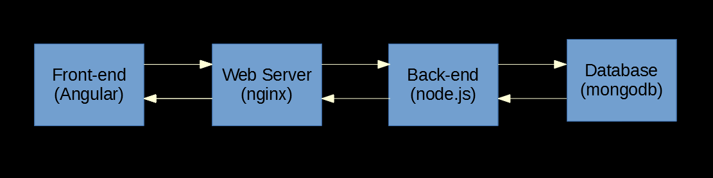

# ng-nest-poc

- Written by Anthony Leotta
- 4/29/2019

## Overview

The components of this POC (Proof of Concept) are a front-end  implemented using Angular 7.x, a web-server/reverse proxy, a back-end RESTfulapp writtein in node.js using the NestJS Typescript framework and mongodb is used to provide persentant data storage.



Docker and docker-composer are used to run the back-end components. the below diagram illustrates that each docker container also has a docker volume that is used to transfer files from the host machine to the running docker images. The volumes are also used to provide a place for the mongodb database files to reside.


## Init Project

1. Initialize git

    ```
    git init
    ```

1. Add a .gitignore

    [https://www.gitignore.io/](https://www.gitignore.io/)

1. Create a new Git repo, Add files and push to [Github.com](https://github.com/datajango/ng-nest-poc)

    ```
    git add .
    git commit -m "first commit"
    git remote add origin git@github.com:datajango/ng-nest-poc.git
    git push -u origin master
    ```
## Create a Nest JS server

In this part a new node.js server is created that serves some static JSON data as a quick way to get started.

1. Install NestJS globally

    ```
    npm i -g @nestjs/cli
    ```

1. Create new NestJS project

    ```
    nest new server
    ```

1. cd server

1. Add a courses controller

    ```
    nest g controller courses
    ```    

1. Add a courses service

    ```
    nest g service courses
    ```    

1. Add server\src\courses\course.ts

    ```
    export interface Course {
        id: string,
        title?: string,
        description?: string,
        author?: string,
        length?: string
    }
    ```

1. server\src\courses\courses.service.ts

    ```
    import { Injectable } from '@nestjs/common';
    import { Course } from './course';

    const courses: Course[] =[
        {
            id: '1',
            title: 'NestJS from Novice to Guru',
            description: 'Lorem ipsum dolor sit amet, consectetur adipiscing elit. Curabitur sit amet neque nec nunc mollis sagittis. Pellentesque vulputate facilisis justo, quis facilisis purus imperdiet pulvinar. Sed elementum dictum dictum. In sem mauris, vestibulum quis ligula quis, eleifend pharetra lectus. Vivamus pulvinar leo in ante hendrerit, at varius risus placerat. Fusce molestie quam id lorem facilisis, vitae tempus leo consectetur.',
            author: 'John Smith',
            length: '4 Hour 45 Minutes'
        },
        {
            id: '2',
            title: 'Angular Material Design Essentials',
            description: 'Lorem ipsum dolor sit amet, consectetur adipiscing elit. Curabitur sit amet neque nec nunc mollis sagittis. Pellentesque vulputate facilisis justo, quis facilisis purus imperdiet pulvinar. Sed elementum dictum dictum. In sem mauris, vestibulum quis ligula quis, eleifend pharetra lectus. Vivamus pulvinar leo in ante hendrerit, at varius risus placerat. Fusce molestie quam id lorem facilisis, vitae tempus leo consectetur.',
            author: 'John Smith',
            length: '3 Hour 33 Minutes'
        },
        {
            id: '3',
            title: 'Mongodb Secrets',
            description: 'Lorem ipsum dolor sit amet, consectetur adipiscing elit. Curabitur sit amet neque nec nunc mollis sagittis. Pellentesque vulputate facilisis justo, quis facilisis purus imperdiet pulvinar. Sed elementum dictum dictum. In sem mauris, vestibulum quis ligula quis, eleifend pharetra lectus. Vivamus pulvinar leo in ante hendrerit, at varius risus placerat. Fusce molestie quam id lorem facilisis, vitae tempus leo consectetur.',
            author: 'John Smith',
            length: '4 Hour 12 Minutes'
        }
    ];

    @Injectable()
    export class CoursesService {

        getCourses(): Course[] {
            return courses;
        }
    }
    ```

1. server\src\courses\courses.controller.ts

    ```
    import { Controller, Get } from '@nestjs/common';
    import { CoursesService } from './courses.service';
    import { Course } from './course';

    @Controller('courses')
    export class CoursesController {

        constructor(private readonly webService: CoursesService) {}

        @Get()
        getCourses(): Course[] {
        return this.webService.getCourses();
        }
    
    }

    ```

## Create a Angular Client

In this part, a small Angular front-end is created using the Angular Command Line tool. A component and service are added that consume the /courses end-point.

1. Use ng cli to create a new Angular application

    ```
    ng new client --routing
    ```

1. Create a courses module, component and service

    ```
    cd client
    ng generate component courses --dry-run
    ng generate component component/courses --dry-run
    ng generate module courses --dry-run
    ng generate module courses --routing --dry-run
    ng generate module courses --routing

    ng generate component courses/components/courses --module courses --dry-run

    ng generate component courses/components/courses --module courses

    ng generate service courses/services/courses --module courses --dry-run

    ng generate service courses/services/courses --module courses
    ```

1. Add Courses modules to app.module.ts

    ```  
    @NgModule({
    declarations: [
        AppComponent
    ],
    imports: [
        BrowserModule,
        AppRoutingModule,
        CoursesModule
    ],
    providers: [],
    bootstrap: [AppComponent]
    })
    export class AppModule { }
    ```

1. However for LazyLoading, remove Courses modules from app.module.ts
    

    ```
    import { NgModule } from '@angular/core';
    import { Routes, RouterModule } from '@angular/router';

    const routes: Routes = [
    {
        path: 'courses',
        loadChildren: './courses/courses.module#CoursesModule'
    },
    {
        path: '',
        redirectTo: '',
        pathMatch: 'full'  
    }
    ];

    @NgModule({
    imports: [RouterModule.forRoot(routes)],
    exports: [RouterModule]
    })
    export class AppRoutingModule { }
    ```

1. Add HttpClientModule to app.module.ts

    ```
    import { HttpClientModule } from '@angular/common/http';
    ```

    ```
    imports: [
        ...
        HttpClientModule,
        ...
    ],
    ```

1. Clean up app.component.html

    ```
    <router-outlet></router-outlet>
    ```

1. client\src\app\courses\components\courses\courses.component.ts

    ```
    import { Component, OnInit } from '@angular/core';
    import { Course } from '../../course';
    import { CoursesService } from '../../services/courses.service';

    @Component({
    selector: 'app-courses',
    templateUrl: './courses.component.html',
    styleUrls: ['./courses.component.sass']
    })
    export class CoursesComponent implements OnInit {
    courses = [];

    constructor(private webService: CoursesService) { 
    
    }

    ngOnInit() {    
        this.webService.getMessages().subscribe((res: any[]) => {
        this.courses = res;
        });
    }

    }
    ```

1. client\src\app\courses\components\courses\courses.component.html

    ```
    <h1>Courses</h1>
    
    <div *ngFor="let course of courses">  
    {{course.id}}
    </div>
    ```

1. client\src\app\courses\services\courses.service.ts

    ```
    import { Injectable } from '@angular/core';
    import { HttpClient } from '@angular/common/http';
    import { Observable } from 'rxjs';
    import { Course } from '../course';

    @Injectable({
    providedIn: 'root'
    })
    export class CoursesService {

    baseUrl: string = "http://localhost:3000";

    constructor(private http: HttpClient) { }

    getMessages(): Observable<Course[]> {

        return this.http.get<Course[]>(this.baseUrl + '/courses');

    }
    }
    ```

## Add Material Desigm

